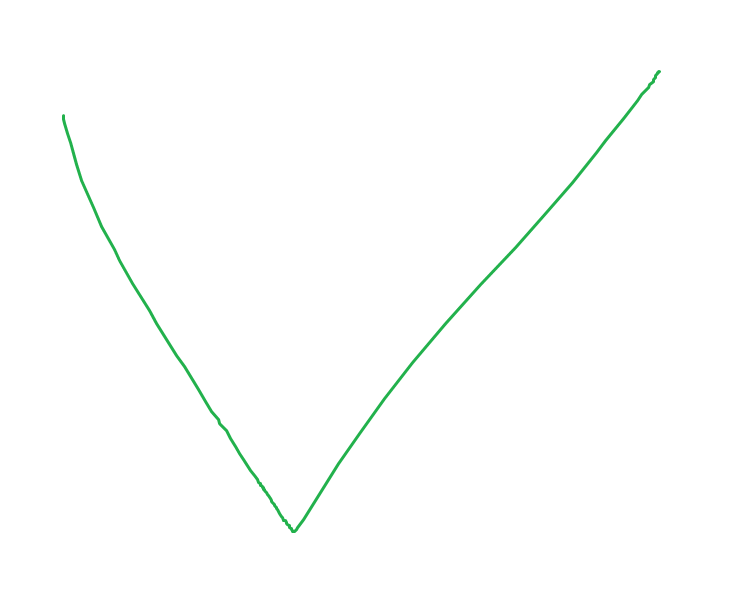

<!-- LATEST ANNOUNCEMENTS -->

# 📣 Latest Announcements

🆕 22-02-2022: We now have a discord server, I strongly encourage all of you to join the server. [Join Server](https://discord.gg/gf9EzqZBe7)

🆕 21-02-2022: Vita is participating in GirlScript Summer of Code 2022 🥳

---

 

<!-- PROJECT SHIELDS -->

[![Contributors][contributors-shield]][contributors-url]
[![Forks][forks-shield]][forks-url]
[![Stargazers][stars-shield]][stars-url]
[![Issues][issues-shield]][issues-url]
[![MIT License][license-shield]][license-url]
[![LinkedIn][linkedin-shield]][linkedin-url]
[![CI/CD Digital Ocean][action-url]][action-url]

<!-- PROJECT LOGO -->
 

  

  <strong>
    <h3 align="center" >Vita</h3>
  </strong>
  

    <strong>
      SEACH SCHEDULE & MEET
    </strong>
     
    <a href="https://github.com/Rishabh-malhotraa/Vita"><strong>Explore the project »</strong></a>
     
     
    <a href="https://vitaa-app.netlify.app/">View Demo</a>
    ·
    <a href="https://github.com/Rishabh-malhotraa/Vita/issues">Report Bug</a>
    ·
    <a href="https://github.com/Rishabh-malhotraa/Vita/issues">Request Feature</a>
  

<!-- TABLE OF CONTENTS -->

  
Table of Contents

  <ol>
    <li>
      <a href="#about-the-project">About The Project</a>
      <ul>
        <li><a href="#demonstration">Demonstration</a></li>
        <li><a href="#built-with">Built With</a></li>
      </ul>
    </li>
    <li>
      <a href="#getting-started">Getting Started</a>
      <ul>
        <li><a href="#prerequisites">Prerequisites</a></li>
        <li><a href="#installation">Installation</a></li>
        <li><a href="#installation">Setting up Database</a></li>
      </ul>
    </li>
    <li><a href="#roadmap">Roadmap</a></li>
    <li><a href="#contributing">Contributing</a></li>
    <li><a href="#license">License</a></li>
    <li><a href="#contact">Contact</a></li>
    <li><a href="#acknowledgements">Acknowledgements</a></li>
  </ol>

## About The Project

- During the pandemic, we all were homebound; the campus culture of each college withered away. Watercooler conversation after class mentoring or Gyan sessions from seniors has become a tail of the past. So to bridge the gap of loss of engagement, I present to you, Vita.
- A SAAS product to _connect college graduates, alumni, and faculty_ to revive the culture of mentorship and foster a more connected and **ENGAGED**(pardon the pun) community.

---

## Design Doc and Video Demonstration

Vita Case Study : [Case Study](https://rishabh-malhotra.notion.site/Vita-Case-Study-110f30b9278649768ead22affc53c5ed)

Vite Application Flow : [User Journey](https://rishabh-malhotra.notion.site/Vita-User-Journey-7495dd0612ec4de1902fce62cc02ddb5)

Video Demonstration : [Video Link](https://drive.google.com/drive/u/0/folders/1uXQ53ieJK1gcbtpfYYxVthMXN5X9SpbM)

---

### Demonstration

![vita-hld]

 

### VITA APP

![product-screenshoti]

|      Mentors Page       |       Topics Page        |
| :---------------------: | :----------------------: |
| ![product-screenshotii] | ![product-screenshotiii] |

|      Submit Form       |   Scheduler Component   |
| :--------------------: | :---------------------: |
| ![product-screenshotv] | ![product-screenshotiv] |

 

---

### Built With

- [React](https://reactjs.org/docs/getting-started.html)
- [NodeJS](https://material-ui.com/getting-started/installation/)

Written in TypeScript ♥

[Contributing Guidelines](CONTRIBUTION.md)

## License

Distributed under the MIT License. See [`LICENSE`][license-url] for more information.

---

## Contact

Rishabh malhotraa - [@rish_bishhh](https://twitter.com/rish_bishhh) - rishabhmalhotraa01@gmail.com

Join Discord Server : https://discord.gg/gf9EzqZBe7

Discord : rishabh.malhotra#4193

Project Link: [https://vitaa-app.netlify.app/](https://vitaa-app.netlify.app/)

---

## Acknowledgements

- [react-query](https://react-query.tanstack.com/)
- [mui](https://mui.com/)
- [emotion](https://emotion.sh/)
- [sokcet-io](https://www.heroku.com/)
- [simple-peer](https://www.npmjs.com/package/simple-peer)
- [Heroku](https://www.heroku.com/)
- [Netlify](https://www.netlify.com/)
- [axios](https://www.npmjs.com/package/axios)
- [Best-README-Template](https://github.com/othneildrew/Best-README-Template)
- [MIT License](https://opensource.org/licenses/MIT)

<!-- https://www.markdownguide.org/basic-syntax/#reference-style-links -->

[all-contributors-shield]: https://img.shields.io/badge/all_contributors-8-orange.svg?style=for-the-badge
[contributors-shield]: https://img.shields.io/github/contributors/Rishabh-malhotraa/Vita.svg?style=for-the-badge
[contributors-url]: https://github.com/Rishabh-malhotraa/Vita/graphs/contributors
[forks-shield]: https://img.shields.io/github/forks/Rishabh-malhotraa/Vita.svg?style=for-the-badge
[forks-url]: https://github.com/Rishabh-malhotraa/Vita/network/members
[stars-shield]: https://img.shields.io/github/stars/Rishabh-malhotraa/Vita.svg?style=for-the-badge
[stars-url]: https://github.com/Rishabh-malhotraa/Vita/stargazers
[issues-shield]: https://img.shields.io/github/issues/Rishabh-malhotraa/Vita.svg?style=for-the-badge
[issues-url]: https://github.com/Rishabh-malhotraa/Vita/issues
[license-shield]: https://img.shields.io/github/license/Rishabh-malhotraa/Vita.svg?style=for-the-badge
[license-url]: https://github.com/Rishabh-malhotraa/Vita/blob/main/LICENSE.txt
[actions-url]: https://github.com/Rishabh-malhotraa/Vita/actions/workflows/build.yaml
[actions-badge]: https://github.com/Vita-App/Vita/actions/workflows/digital-ocean.yaml
[linkedin-shield]: https://img.shields.io/badge/-LinkedIn-black.svg?style=for-the-badge&logo=linkedin&colorB=555
[linkedin-url]: https://www.linkedin.com/in/rishabh-malhotra-4536a418b
[product-demo]: images/Vita-demonstation.gif
[product-screenshoti]: assets/user-page.png
[product-screenshotii]: assets/mentors.png
[product-screenshotiii]: assets/topics.png
[product-screenshotiv]: assets/scheduler.png
[product-screenshotv]: assets/confirm-booking.png
[vita-hld]: assets/vita-hld.png
[action-url]: https://github.com/Vita-App/Vita/actions/workflows/digital-ocean.yaml/badge.svg

<!-- ALL-CONTRIBUTORS-BADGE:START - Do not remove or modify this section -->

<!-- ALL-CONTRIBUTORS-BADGE:END -->

## Stargazers over time

## Contributors ✨

Thanks goes to these wonderful people ([emoji key](https://allcontributors.org/docs/en/emoji-key)):

<!-- ALL-CONTRIBUTORS-LIST:START - Do not remove or modify this section -->
<!-- prettier-ignore-start -->
<!-- markdownlint-disable -->
<table>
  <tr>
    <td align="center"><a href="https://rishabh-malhotraa.github.io/Rishabh-Portfolio-main/"> <b>Rishabh Malhotra</b></a> <a href="#infra-Rishabh-malhotraa" title="Infrastructure (Hosting, Build-Tools, etc)">🚇</a> <a href="#data-Rishabh-malhotraa" title="Data">🔣</a> <a href="#design-Rishabh-malhotraa" title="Design">🎨</a> <a href="https://github.com/Vita-App/Vita/commits?author=Rishabh-malhotraa" title="Code">💻</a> <a href="#video-Rishabh-malhotraa" title="Videos">📹</a> <a href="https://github.com/Vita-App/Vita/pulls?q=is%3Apr+reviewed-by%3ARishabh-malhotraa" title="Reviewed Pull Requests">👀</a></td>
    <td align="center"><a href="https://github.com/Lalit3716"> <b>Lalit</b></a> <a href="https://github.com/Vita-App/Vita/commits?author=Lalit3716" title="Code">💻</a> <a href="#design-Lalit3716" title="Design">🎨</a> <a href="https://github.com/Vita-App/Vita/pulls?q=is%3Apr+reviewed-by%3ALalit3716" title="Reviewed Pull Requests">👀</a> <a href="https://github.com/Vita-App/Vita/commits?author=Lalit3716" title="Tests">⚠️</a></td>
    <td align="center"><a href="https://github.com/indraantoor"> <b>Indraan S. Toor</b></a> <a href="https://github.com/Vita-App/Vita/commits?author=indraantoor" title="Code">💻</a></td>
    <td align="center"><a href="https://github.com/Sahaj-Srivastava24"> <b>Mad1ad</b></a> <a href="https://github.com/Vita-App/Vita/commits?author=Sahaj-Srivastava24" title="Code">💻</a></td>
    <td align="center"><a href="https://github.com/DevRish"> <b>Rishav Chattopadhya</b></a> <a href="https://github.com/Vita-App/Vita/commits?author=DevRish" title="Code">💻</a></td>
  </tr>
  <tr>
    <td align="center"><a href="https://github.com/Gurdeep475"> <b>Gurdeep Singh</b></a> <a href="https://github.com/Vita-App/Vita/commits?author=Gurdeep475" title="Code">💻</a> <a href="#maintenance-Gurdeep475" title="Maintenance">🚧</a></td>
    <td align="center"><a href="http://linkedin.com/in/hzmessam"> <b>Hazem Essam</b></a> <a href="https://github.com/Vita-App/Vita/commits?author=hazemessam" title="Code">💻</a> <a href="#maintenance-hazemessam" title="Maintenance">🚧</a></td>
    <td align="center"><a href="http://muzam1l.com"> <b>muzamil</b></a> <a href="https://github.com/Vita-App/Vita/commits?author=muzam1l" title="Code">💻</a></td>
    <td align="center"><a href="http://harshiljani2002@gmail.com"> <b>Harshil Jani</b></a> <a href="#infra-Harshil-Jani" title="Infrastructure (Hosting, Build-Tools, etc)">🚇</a></td>
    <td align="center"><a href="https://github.com/DTFds"> <b>Daniel Siebert</b></a> <a href="#infra-DTFds" title="Infrastructure (Hosting, Build-Tools, etc)">🚇</a></td>
  </tr>
  <tr>
    <td align="center"><a href="https://github.com/ancoreraj"> <b>Ankur Raj</b></a> <a href="https://github.com/Vita-App/Vita/commits?author=ancoreraj" title="Code">💻</a></td>
  </tr>
</table>

<!-- markdownlint-restore -->
<!-- prettier-ignore-end -->

<!-- ALL-CONTRIBUTORS-LIST:END -->

This project follows the [all-contributors](https://github.com/all-contributors/all-contributors) specification. Contributions of any kind welcome!
